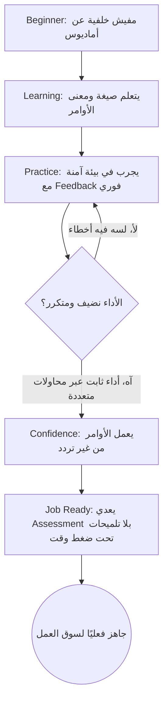
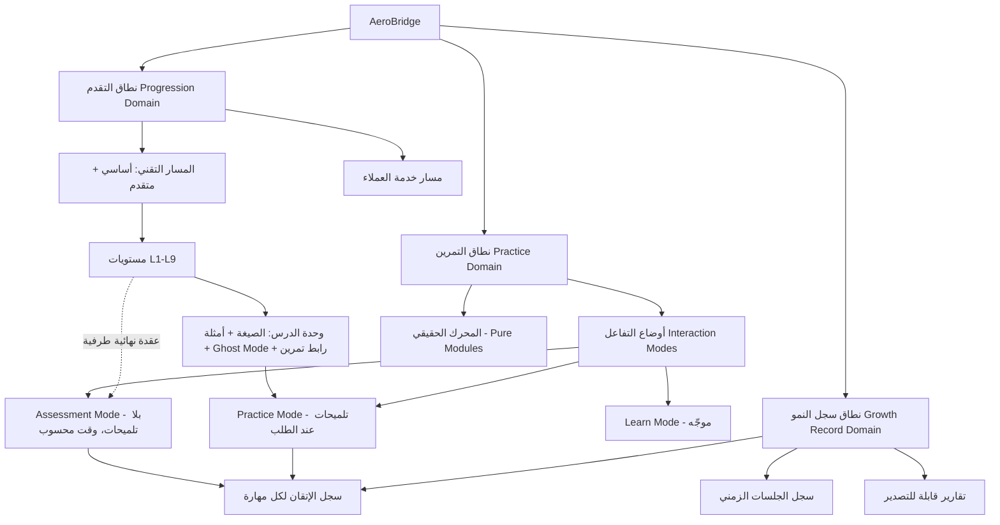

# PRODUCT_STRATEGY_UX_ARCHITECTURE.md — منصة AeroBridge

> **الحالة:** مسوّدة كاملة — الأقسام 1-14. جاهزة للمراجعة النهائية قبل الانتقال لـPhase 2 (Design System & UI Blueprint).
> **نوع الوثيقة:** استراتيجية ومعمارية منتج فقط — **صفر UI، صفر Design System، صفر Wireframes**. أي إشارة لعنصر بصري هنا (لون/شكل/تخطيط) ممنوعة عمدًا في المرحلة دي.
> **علاقتها بالملفات القديمة:** UI_GUIDELINES.md وDESIGN_SYSTEM.md وترتيب المراحل في PROJECT.md §4 وبروتوتايب v0 — **كلهم Archive، مش مرجع**. أي حاجة فيهم هتتبنى تاني، لازم تكون لأنها استنتاج مستقل من الوثيقة دي، مش لأنها "كانت موجودة قبل كده".
> **إيه اللي اتحمل من الشغل القديم كحقيقة واقع، مش قرار تصميم:** الـStack التقني (HTML/CSS/Vanilla JS، GitHub Pages، صفر Backend)، المحرك المُراجَع فعليًا (parser.js/pnr.js/pricing.js/ancillary.js/queues.js/seatmaps.js/errors.js)، ومحتوى المنهج (كورسي مصر للطيران Basic/Advanced + مسار خدمة العملاء). دول مش "تصميم" نعيد التفكير فيه — دول حدود الواقع اللي أي حل لازم يشتغل جواها (Rule 8).

---

## سجل قرار تأسيسي #0 — نطاق الطموح والجمهور

**المشكلة:** هل نصمم المنتج لمستخدم حقيقي واحد محدد (أنا وأخويا) وله مخاطر حقيقية (شغل فعلي)، ولا لسوق افتراضي أوسع من اليوم الأول؟ القرار ده بيتحكم في كل قرار جاي — الـPersonas، استراتيجية الرجوع للمنتج (Retention)، معايير النجاح، وحتى عمق التفكير في التوسع المستقبلي.

**التبرير:** عندنا مستخدمين حقيقيين اتنين بمخاطر حقيقية (تأهل لسوق شغل فعلي)، ومفيش أي دليل على طلب سوق أوسع دلوقتي. البناء لِـPersonas وهمية دلوقتي معناه حل مشاكل متخيلة على حساب حل مشاكل حقيقية موجودة قدامنا. في نفس الوقت، قفل الباب تمامًا قدام التوسع لو التجربة نجحت قرار متسرّع بنفس القدر — طالما إحنا لسه بنكتب معمارية، ثمن الحفاظ على الباب مفتوح رخيص.

**البدائل اللي اتقيّمت:**
| البديل | القرار | السبب |
|:---|:---:|:---|
| شخصي فقط للأبد، بلا اعتبار للمستقبل | ❌ مرفوض | بيقفل الباب قدام فرصة حقيقية لو المنتج نجح فعليًا معانا |
| نبني لسوق فعلي من اليوم الأول (Personas متعددة، Business Model، إلخ) | ❌ مرفوض | تعقيد إضافي بلا أي دليل يبرره الآن، وهيبطّئنا عن حل المشكلة الحقيقية القائمة |
| **شخصي أولًا كـPersona تصميم وحيدة حقيقية + معمارية "واعية للتوسع"** | ✅ المُختار | نصمم لأنا وأخويا فقط، لكن نتجنب قرارات بيانات/هيكلة تقفل الباب قدام مستخدمين إضافيين لاحقًا، من غير ما نبني أي حاجة Multi-user فعليًا الآن |

**الأثر على تجربة الاستخدام:** كل قرار تصميم لاحق هيتحاكم بسؤال واحد بس: *"هل ده بيساعدنا فعليًا نتعلم ونتأهل؟"* — مش "هل ده بيبيع كويس لسوق أوسع؟"

**الأثر الهندسي:** هنتجنب بس القرارات المكلفة الرجوع فيها لاحقًا (مثال: تخزين سجل التقدم بشكل معزول منطقيًا لكل متعلم حتى بدون نظام حسابات فعلي)، من غير ما نبني Backend أو Auth دلوقتي — وده أصلًا متوافق مع القيد التقني الأساسي (Frontend-only/Static).

---

## 1. رؤية المنتج (Product Vision)

**Mission (الرسالة):**
تأهيل أي متعلم ذاتي — يبدأ بيا وبأخويا — لدخول سوق شغل الحجز والتذاكر في الطيران السعودي/الخليجي فعليًا، عن طريق تدريب عملي حقيقي على أوامر أماديوس، لا نظري ولا مُدّعى.

**Vision (الرؤية):**
مكان تتمرن فيه على أماديوس بنفس واقعية الشغل الحقيقي — من موبايلك، من غير ما تدفع لمركز تدريب، ومن غير ما تستنى فرصة وظيفة عشان تلمس نظام حقيقي لأول مرة.

**Core Value Proposition (القيمة الجوهرية):**
الفجوة الحقيقية مش في المعرفة النظرية — الكورسات والفيديوهات والـPDFs موجودة ومتاحة. الفجوة في **التكرار العملي الصادق**: محدش بيقولك بصراحة "الأمر ده شغال فعليًا" و"ده لسه مش مُنفَّذ"، ومحدش بيدّيك نفس الأوامر اللي هتكتبها فعليًا في يوم شغلك الأول، بردود نظام حقيقية مش مُلفّقة. AeroBridge بيحل المشكلة دي بالذات: تدريب عملي، صادق في نطاقه، على نفس الأوامر الحقيقية.

---

## 2. الجمهور المستهدف (Target Audience)

### Primary Persona — "المتعلم الذاتي" (النموذج الحقيقي: مالك وأخوه)

| البُعد | الوصف |
|:---|:---|
| **الخلفية** | مصري، متعلم ذاتيًا، خلفية برمجية ضعيفة-لمبتدئة (حتى لو هو نفسه اللي بيبني الأداة) |
| **الدافع** | تأهل حقيقي لسوق شغل الحجز/التذاكر في السعودية والخليج (Almosafer/Seera, Flynas, Flyadeal, Saudia GSAs) |
| **الخلفية التعليمية** | تعرّض لمحتوى تدريب أماديوس (منهج مصر للطيران) لكن من غير بيئة تمرين عملي حقيقي |
| **الجهاز** | موبايل بشكل أساسي، لابتوب لاحقًا |
| **تحمّل المخاطرة** | مرتاح لأداة بتتطور مع الوقت (هو نفسه بيبنيها) — لكن محتاج **صدق مطلق** في القدرات المعروضة لأنه فعليًا معتمد عليها لبناء مهارة حقيقية |
| **أكبر مخاوفه** | يوصل لمقابلة أو أول يوم شغل ويكتشف إنه حافظ غلط، أو إنه اتمرّن على حاجة مش موجودة في النظام الحقيقي |

### Secondary Persona — "سوق مستقبلي محتمل" (تخميني بالكامل، مش هدف تصميم حالي)

متعلم ذاتي مصري/خليجي تاني، بنفس الملف الشخصي تقريبًا، لكن بدون علاقة مباشرة بمالك. **هذا الـPersona مش هدف قرارات تصميم في هذه المرحلة** — استخدامه الوحيد المسموح: التأكد إن قرارات الـIA في §6 مبتبنيش افتراضات تمنع لاحقًا وجود مستخدمين إضافيين (Section 13 هتفصّل ده أكتر).

---

## 3. نقاط الألم (Pain Points) — مرتبة حسب الأولوية

| # | نقطة الألم | التفصيل |
|:---:|:---|:---|
| 1 | **نظري بدون تطبيق عملي** | التدريب التقليدي (PDF/فيديو/محاضرة) بيشرح صيغة الأوامر لكن مبيوفّرش تكرار عملي حقيقي — المتعلم بيوصل للمقابلة أو الشغل وهو حافظ مش متمكّن |
| 2 | **الوصول للتدريب الحقيقي مكلف ومحدود** | مراكز التدريب الفعلية (زي مركز مصر للطيران) مش متاحة للكل، وبتكلف وقت وفلوس |
| 3 | **غياب Feedback فوري وصادق على الأخطاء** | لما تغلط في كتابة أمر، مفيش حد يقولك ليه غلط بالظبط وإيه الفرق عن الصيغة الصحيحة في نفس اللحظة |
| 4 | **تشابه/التباس بين أوامر متقاربة** | الفرق بين FQD الاسترشادي وFXP الفعلي، أو ER/ET مقابل RT/XE — غموض حقيقي حتى لمتدربين درسوا المنهج بالفعل |
| 5 | **صعوبة التمرين على السرعة تحت ضغط** | بيئة الشغل الحقيقي (Call Center) بتحتاج سرعة وقلة أخطاء، ومفيش وسيلة تتمرن بيها على ده من غير بيئة شغل حقيقية |
| 6 | **حاجز اللغة** (أولوية أقل حاليًا، مهم مستقبلًا) | أغلب مصادر تدريب أماديوس إنجليزي بحت، وده عائق لبعض المتعلمين لسه بيقووا لغتهم الإنجليزية |

---

## 4. المهام المطلوب إنجازها (Jobs To Be Done)

بصيغة *"لما [الموقف]، عايز [الدافع]، عشان [النتيجة]"*:

1. **لما** أكون خلصت شرح نظري لأمر أماديوس، **عايز** أطبقه فورًا على نظام بيرد بنفس منطق النظام الحقيقي، **عشان** أتأكد إني فاهم صح مش بس حافظ.
2. **لما** أغلط في كتابة أمر، **عايز** أفهم ليه غلط وإيه الصيغة الصحيحة فورًا، **عشان** محفظش غلط أو أكرره في مقابلة أو شغل حقيقي.
3. **لما** أكون قرّبت لمقابلة أو أول يوم شغل، **عايز** أختبر نفسي بسيناريوهات واقعية تحت ضغط وقت، **عشان** أطمّن نفسي إني جاهز فعلاً.
4. **لما** أراجع تقدمي، **عايز** أعرف بالظبط إيه اللي أنا متمكّن فيه وإيه اللي لسه ضعيف، **عشان** أوجّه مجهودي صح بدل ما أكرر نفس الحاجة.

---

## 5. رحلة المستخدم (User Journey)

**Beginner → Learning → Practice → Confidence → Job Ready**

| المرحلة | الوصف | الاحتياج الأساسي |
|:---|:---|:---|
| **Beginner** | مالوش أي خلفية عن أماديوس، مش عارف حتى شكل الشاشة | تعريف مبسّط + طمأنة إن الموضوع مش معقد زي ما يبان |
| **Learning** | بيتعلم صيغة الأوامر ومعناها | شرح واضح + أمثلة حقيقية (Ghost Mode) |
| **Practice** | بيجرب الأوامر بنفسه في بيئة آمنة | Feedback فوري وصادق على كل خطأ |
| **Confidence** | بيكرر نفس السيناريوهات لحد ما يعملها من غير تردد | تكرار مُقاس (مش نجاح مرة واحدة وخلاص) |
| **Job Ready** | قادر يعدي سيناريوهات واقعية تحت ضغط وقت، وقادر يشرح شغله بإنجليزية مهنية للعميل | تقييم حقيقي بلا تلميحات + كفاءة مزدوجة (تقني + تواصل) |

**ملحوظة مهمة:** السهم من D إلى C (مش من C لـE مباشرة) قرار متعمّد — النجاح لمرة واحدة مش دليل إتقان. هذا مبدأ موجود بالفعل في تصميم المحرك (نظام `cleanRunsNeeded` — عدد محاولات نضيفة متتالية قبل فتح المستوى التالي)، وبيتأكد هنا كجزء من رحلة المستخدم الرسمية، مش مجرد تفصيل تقني معزول.

---

## 6. المعمارية المعلوماتية (Information Architecture)

> تذكير: القسم ده عن **الهيكل والعلاقات فقط** — مفيش شاشات، مفيش تخطيط بصري، مفيش Navigation نهائي. أي أسماء "مناطق" (Domains) تحت هي تجميع منطقي للمحتوى، مش أسماء تابات أو شاشات نهائية — ده قرار المرحلة الجاية (Phase 2).

### النطاقات الجوهرية الثلاثة (Core Domains)

### وصف العلاقات الجوهرية

**نطاق التقدم (Progression):** فيه مساران متوازيان — المسار التقني (أوامر أماديوس، مبني على مستويات L1-L9 المرتبطة فعليًا بمستويات وظيفية مرجعية Junior Reservation Agent → Call Center Agent → Ticketing Specialist) ومسار خدمة العملاء (تواصل، سيناريوهات، إنجليزي مهني). المساران منفصلان في المحتوى لكن بيصبّوا في **نفس سجل النمو** — الكفاءة المزدوجة (تقني + تواصل) هدف واحد مش هدفين منفصلين.

**نطاق التمرين (Practice):** مش بيئة واحدة بسلوك ثابت — **قرار معماري مهم**، مفصّل تحت.

**نطاق سجل النمو (Growth Record):** كل تفاعل من أي نطاق (تقدم أو تمرين) بيسجّل هنا. ده المصدر الوحيد لأي "أنا فين دلوقتي" — مفيش نسخة تانية من نفس البيانات في أي مكان تاني (نفس مبدأ "مصدر واحد للحقيقة" اللي أثبت نفسه في التوثيق الفني).

### سجل قرار — أوضاع التفاعل (Interaction Modes)

**المشكلة:** هل بيئة التمرين (Terminal) شيء واحد بسلوك ثابت، ولا لازم يتغيّر سلوكها حسب السياق (بيتعلم / بيتمرن / بيتقيّم)؟

**التبرير:** فيه قرار تقني سابق موثّق فعليًا (مواصفة Phase 14 الموجودة) بيفرّق بين وضع بيوجّه المتدرب (تلميحات متاحة) ووضع بيقيّمه (بدون تلميحات، وقت محسوب). ده مش قرار شكل — هو قرار سلوك ومنطق، وبالتالي محترم هنا كحقيقة واقع مش بيُعاد التفكير فيه من الصفر.

**البدائل:**
| البديل | القرار |
|:---|:---:|
| بيئة واحدة بسلوك ثابت دايمًا | ❌ لو التلميحات موجودة دايمًا، أي "تقييم نهائي" مش بيقيس جاهزية حقيقية |
| **بيئة Practice واحدة بأوضاع مختلفة (Learn/Practice/Assessment) فوق نفس المحرك** | ✅ المُختار |

**الأثر على التجربة:** المتدرب بيحس إنه بيتمرن في بيئة واحدة متسقة، مش بيتنقل بين "ألعاب" منفصلة.
**الأثر الهندسي:** كود المحرك (parser.js/pnr.js...) يفضل زي ما هو تمامًا — الفرق كله في طبقة التوجيه (event-bridge.js/coaching.js) اللي بتقرر تدّي تلميح ولا لأ حسب الوضع الحالي.

### سجل قرار — نقطة الدخول (Entry / Landing Logic)

**المشكلة:** لما المتعلم يفتح التطبيق، أول حاجة يشوفها إيه؟ خريطة تقدم كاملة، ولا استكمال مباشر لآخر نشاط؟

**التبرير:** الأداة مبنية لجلسات تمرين مركّزة وإرادية، مش عادة يومية عارضة. المستخدم الحقيقي (أنا/أخويا) عنده دافع داخلي حقيقي (شغل)، مش محتاج "إغراء" للرجوع. أهم حاجة هي أقل احتكاك ممكن للوصول لنفس نقطة التمرين.

**البدائل:**
| البديل | القرار |
|:---|:---:|
| خريطة تقدم كاملة كل مرة يفتح فيها التطبيق | ❌ احتكاك زيادة لمستخدم عارف هو واصل لفين أصلًا |
| **نقطة دخول خفيفة: "استكمل من هنا" (آخر نشاط) + وصول مباشر لتمرين حر بغض النظر عن التقدم** | ✅ المُختار |

**الأثر على التجربة:** أقل عدد خطوات للوصول لأهم فعل (التمرين نفسه)، مع بقاء مسار موجّه متاح لمن يحتاجه.
**الأثر الهندسي:** بسيط — يحتاج بس تتبّع "آخر نشاط" داخل سجل الأحداث (Event Log)، وهو مفهوم موجود أصلًا في التصميم التقني.

---

## 7. استراتيجية التنقل (Navigation Strategy)

> تذكير: "تنقل" هنا يعني **قواعد سلوكية تحكم إزاي المتعلم بيتحرك بين المفاهيم**، مش تصميم شريط تابات أو قائمة. الشكل النهائي قرار Phase 2.

| النوع | القاعدة الحاكمة |
|:---|:---|
| **Primary Navigation** | التنقل بين النطاقات الثلاثة (تقدم/تمرين/سجل نمو) — الثلاثة متساويين في الأهمية ومتاحين بلمسة واحدة من أي مكان، مش مرتبين كتسلسل خطي إجباري |
| **Secondary Navigation** | داخل كل نطاق: في التقدم بين المسارين والمستويات؛ في سجل النمو بين السجل/التاريخ/التقارير |
| **Context Navigation** | مداخل بتظهر حسب الحالة اللحظية مش من قايمة ثابتة — مثال: خطأ حصل في التمرين → مدخل Coach بيظهر مكانه مباشرة؛ مستوى اتقفل → أقرب فعل تالي مقترح يبان تلقائيًا |
| **Progress Navigation** | مؤشرات التقدم نفسها بتشتغل كمدخل تنقل، مش عرض بصري بس — أي مؤشر تقدم لازم يكون قابل للضغط ويوديك لمكانه، ممنوع يكون تزييني بحت |
| **Terminal Navigation** | جلسة التمرين النشطة (خصوصًا Assessment) بيئة "منغمسة" — عناصر التنقل المحيطة تقل قصدًا وقت الجلسة (تركيز شبيه بمشغّل حجز حقيقي)، لكن لازم يفضل فيه مخرج واضح دايمًا. الخروج وسط بناء PNR غير مكتمل لازم يطلع تنبيه صريح، مش فقدان صامت للحالة |
| **Coach Navigation** | مدخلين لنفس المنطق: تلقائي عند خطأ (Context Navigation)، ويدوي بطلب المتعلم من داخل جلسة التمرين أو من سجل النمو (لمراجعة نمط أخطاء متكرر) — نفس البيانات، سياقين للوصول |

---

## 8. استراتيجية تجربة التعلّم (Learning Experience Strategy)

| الوظيفة | الاستراتيجية |
|:---|:---|
| **التعليم (Teach)** | ربط صيغة الأمر (من COMMAND_REFERENCE.md حصرًا، صفر اختلاق) بـ"ليه" مش بس "إزاي". قارنت بين 3 أساليب: (أ) أمثلة ثابتة بس (ب) عرض متحرك حرف-بحرف بإيقاع كتابة واقعي (ج) ملء فراغات تفاعلي. اخترت **(ب) للتعريف الأول + (أ) كمرجع سريع دائم** — (ب) بيبني حس السرعة والتسلسل الحقيقي، (ج) اتأجل لأنه بيضيف تعقيد هندسي بمخاطرة إنه يبقى "مساعدة" بتكسر مبدأ الواقعية |
| **التمرين (Practice)** | داخل Practice Mode المتصل بالمحرك الحقيقي، بتكرار مُقاس (cleanRunsNeeded) مش نجاح لمرة واحدة |
| **التصحيح (Correct)** | فوري، محدد، مبني على تصنيف الأخطاء الحقيقي (8 فئات من errors.js). **قاعدة صارمة:** رسالة الخطأ الرسمية تتعرض زي ما هي بالظبط، والشرح المبسّط بيتحط جنبها — ممنوع استبدالها برسالة "ألطف" لأن ده بيكسر الواقعية. **ملحوظة تشغيلية:** مش كل الفئات الثمانية محتاجة نفس عمق الرد — أخطاء الصيغة/البيانات (FORMAT/DATA_REFERENCE) عادة كافي فيها تصحيح مباشر، بينما الأخطاء المفاهيمية (SEQUENCE/LOGICAL) ممكن تستفيد من ربط أعمق (زي الرجوع لدرس ذي صلة). **مصفوفة تشغيلية كاملة لكل فئة قرار Phase 2/3 بعد استخدام فعلي، مش Phase 1** — تحديدها دلوقتي بدون بيانات استخدام حقيقية هيبقى تخمين مبكر |
| **التشجيع (Encourage)** | تعزيز نوعي مرتبط بموقف حقيقي (مثال: نجاح في التفريق بين FQD وFXP)، مش مديح عام لأي فعل — المديح الفارغ بيفقد قيمته وبيضعف الثقة في أي تقييم لاحق |
| **الاحتفاظ بالمعرفة (Retain)** | تكرار متباعد ومتداخل (Interleaving): مهارات اتقنت قبل كده تتحط تاني جوه تمارين لاحقة بدل تسلسل خطي بحت، عشان مفيش مهارة "تتنسى" بعد ما تتعدى |
| **التحدي (Challenge)** | تصعيب عن طريق تعقيدات حقيقية موجودة فعليًا في المحرك (تعدد ركاب، رحلة ذهاب وعودة، خدمات إضافية) لا صعوبة مصطنعة، زائد Speed Drills لقياس السرعة الفعلية (CPM) |
| **المكافأة (Reward)** | إشارة صادقة على نمو حقيقي (نسبة خطأ متناقصة، فتح مستوى مرتبط بمسمى وظيفي حقيقي) — صفر نقاط أو شارات مفصولة عن مهارة فعلية |

---

## 9. استراتيجية الاحتفاظ بالمستخدم (Retention Strategy)

**سجل قرار — رفض آليات الإدمان السطحية:**

**المشكلة:** إزاي نخلّي المتعلم يرجع للأداة باستمرار؟

**البدائل:**
| البديل | القرار |
|:---|:---:|
| Streaks/تنبيهات إلحاحية/ضغط نفسي للرجوع اليومي | ❌ مرفوض — المستخدم الحقيقي (أنا/أخويا) عنده دافع حقيقي (شغل)، وأي ضغط صناعي هيبقى مصطنع وممكن يرتد عكسيًا |
| Push Notifications دورية "منستنيش رجوعك" | ❌ مرفوض — محتاجة بنية Backend فعليًا أصلًا (تتعارض مع القيد التقني)، وحتى لو أمكن محليًا عبر PWA، دي مش لغة مناسبة لمستخدمين بدافع حقيقي أصلًا |
| **تحفيز مبني على وضوح النمو الحقيقي + سهولة الرجوع لنفس النقطة + معالم مرتبطة بمسميات وظيفية حقيقية** | ✅ المُختار |

**التفصيل:**
1. سجل النمو الصادق (لو دقيق) محفّز بذاته — رؤية "أنا فعلاً بقيت أسرع/أقل أخطاء" أقوى من أي Streak
2. معالم مرتبطة بواقع فعلي: "وصلت لمستوى Call Center Agent" له معنى حقيقي، مش رقم تعسفي
3. نقطة رجوع بلا احتكاك (قرار "استكمل من هنا" في §6)
4. كل جلسة تمرين تنتهي بخلاصة صادقة وواضحة ("تحسّنت في X، لسه ضعيف في Y") بدل ضغط "متقطعش السلسلة"

**تنبيه هندسي محتمل مستقبلي (اختياري لا إجباري):** تذكير محلي (PWA Local Notification) بيضبطه المتعلم لنفسه بنفسه — أداة يتحكم فيها هو، مش دفعة من النظام.

---

## 10. مبادئ تجربة الاستخدام (UX Principles) — حاكمة لأي قرار تصميم لاحق

| # | المبدأ | المعنى العملي |
|:---:|:---|:---|
| 1 | **الصدق قبل الجمال** | لو حاجة مش شغالة فعليًا، تتعرض بوضوح كده — مش تتقنّع بشكل يوهم إنها شغالة |
| 2 | **الواقعية غير قابلة للتفاوض جوه بيئة التمرين** | أي مساعدة بصرية توضّح الواقع، لا تسهّله عنه |
| 3 | **أقل احتكاك للفعل الأهم** | الوصول لبيئة التمرين نفسها له أولوية فوق أي شاشة تانية |
| 4 | **كل تفاعل مفهوم السبب** | مفيش نتيجة (نجاح/فشل) من غير سبب واضح مرتبط بيها مباشرة |
| 5 | **التقدم له اتجاه واحد واضح** | المتعلم يعرف "الخطوة الجاية إيه" من غير ما يفكر |

---

## 11. مبادئ المنتج الثابتة (Product Principles)

| # | المبدأ |
|:---:|:---|
| 1 | **لا اختلاق (No Fabrication)** — أي سلوك/أمر/رد لازم يكون موثّق من كود شغال فعليًا، مش من الذاكرة العامة عن أماديوس |
| 2 | **التعلّم بالممارسة** — أي مفهوم جديد يوصل لتمرين فعلي بأسرع وقت ممكن |
| 3 | **البساطة قبل الزخرفة** — أي عنصر لازم يخدم هدف تعليمي واضح، أو يتشال |
| 4 | **كل مرحلة/شاشة هدف مركزي واحد** | لا تعدد أهداف يشتت |
| 5 | **النطاق الصادق (Honest Scope)** — أي ميزة بلا غطاء كودي حقيقي تُوسم كخطة مستقبلية، ما تتعرضش كمتاحة |

---

## 12. معايير النجاح (Success Metrics)

> بما إن النطاق شخصي حاليًا (قرار #0)، المعايير **تعلّمية بحتة**، مش معايير عمل/نمو (DAU/تحويل/إيراد بلا معنى عند مستخدمين اتنين).

**معايير المرحلة الحالية (Phase 1 — استخدام شخصي):**
- نسبة إتقان المنهج (لكل مسار: تقني / خدمة عملاء)
- اتجاه نسبة الأخطاء لكل جلسة (تناقص = إشارة حقيقية)
- زمن إنجاز PNR كامل من البداية للنهاية (مؤشر سرعة لجاهزية الشغل)
- عدد المحاولات النضيفة المتتالية لكل مستوى (إشارة الإتقان الفعلي)
- نتيجة/معدل نجاح Assessment عند الوصول له

**قيد واقعي صريح:** بما إن الـStack ستاتيك بلا Backend، المقاييس دي محلية على الجهاز بس عبر Event Log — مفيش تجميع بيانات عبر مستخدمين حاليًا، وده متوقّع وطبيعي عند النطاق الحالي.

**معايير مؤجلة (Phase 2 افتراضي فقط، لو التوسع حصل):** معدلات رجوع، Funnel اكتمال، تحويل — غير مطلوبة ولا مُتتبَّعة الآن.

**ملحوظة صريحة على Speed Drills/CPM:** أي حد فاصل رقمي مطلق (زي "كذا حرف بالدقيقة = جاهز لسوق العمل") **لازم يُبنى من بيانات حقيقية مصدرها موثّق** (تواصل فعلي مع مكاتب حجز/Call Centers)، مش رقم مُخترع. لحد ما يتوفر مصدر موثوق، المقياس يفضل **نسبي** (تحسّن الأداء الذاتي عبر الوقت) مش مقارنة بعتبة مطلقة غير مؤكدة — تطبيق مباشر لمبدأ §11-1 (لا اختلاق) على بيانات السوق زي ما بيتطبق تمامًا على سلوك أماديوس.

---

## 13. التوسع المستقبلي (Future Scalability)

> **الإطار الحاكم:** كل بند تحت اتقيّم بمعيارين — هل ممكن يتحقق جوه الـStack الحالي (ستاتيك/Vanilla) من غير Backend، وهل هو فعلاً قريب من الرسالة الجوهرية (تأهل حقيقي لسوق العمل) ولا Scope Creep؟

| الاتجاه | ممكن جوه الـStack الحالي؟ | تأثير معماري | التوصية |
|:---|:---:|:---|:---|
| **AI Coach** | ✅ ممكن فعليًا — لو المتعلم بيستخدم مفتاح API خاص بيه من المتصفح مباشرة (زي نمط "Claude في Artifacts")، من غير سيرفر وسيط | إضافة طبقة نداء API اختيارية فوق Coach الحالي | **الأقرب للتنفيذ** من كل البنود دي |
| **Additional Learning Modules** | ✅ ممكن كليًا — التوسعة موثّقة أصلًا في AMADEUS_CURRICULUM.md (Reissue, EMD, Revalidation...) | توسعة محرك + منهج فقط، الـIA الحالية (نطاق التقدم) بتستوعبها من غير تغيير جوهري | **جاهز للتنفيذ لما المحرك يتوسّع** — أوضح مسار توسع بالكامل |
| **Certifications** | 🟡 جزئيًا — تقرير محلي قابل للتصدير (PDF) "سجل ذاتي" أمكن حاليًا، لكن **شهادة موثّقة/قابلة للتحقق (QR/رابط تحقق)** محتاجة Backend فعليًا | نسخة محلية غير موثّقة الآن، نسخة موثّقة = قرار Phase 2 كامل | ابدأ بالنسخة المحلية الصادقة، أجّل التوثيق الخارجي |
| **Multiplayer** | 🟡 جزئيًا فقط | مقارنة تقدم بين شخصين حقيقيين معروفين (أنا وأخويا فعليًا) ممكنة بمزامنة بسيطة لاحقًا؛ أي مطابقة عشوائية/تنافس مفتوح محتاج Backend وبنية اجتماعية كاملة | **دفع واضح (Rule 3):** التنافس الاجتماعي المفتوح بيتعارض مع مبدأ §9 (رفض التحفيز الصناعي) وبيبعد عن الرسالة الجوهرية — لو اتعمل، يكون "مقارنة بين شريكَي تدريب حقيقيين" بس، مش Matchmaking |
| **Pro Features** | ❌ محتاج Backend كامل (تتبّع اشتراك/صلاحيات) | إعادة هيكلة كاملة | مؤجل لقرار "Phase 2: منتج حقيقي" الكامل، مش تدريجي |
| **Enterprise** | ❌ محتاج لوحة تحكم إدارية ونظام صلاحيات متعدد المستخدمين | إعادة هيكلة كاملة + منتج جانبي فعليًا (B2B) | بعيد جدًا عن النطاق الحالي، غير مطروح للتفكير الجاد الآن |
| **Marketplace** | ❌ محتاج إشراف محتوى ومدفوعات ومؤلفين متعددين | إعادة هيكلة كاملة | **دفع واضح (Rule 3):** بعيد عن الرسالة الجوهرية (تأهل فردي لسوق عمل)، قيمته غير واضحة حتى لو توفرت الموارد — أقرب لـ Scope Creep من فرصة حقيقية |

---

## 14. المخاطر ونقاط الضعف (Risks & Weaknesses)

| النوع | الخطر | التخفيف |
|:---|:---|:---|
| **منتج** | الاعتماد شبه الكامل على الدافع الداخلي الحقيقي (§9) — لو الدافع قلّ، مفيش "خطّاف" صناعي يرجّع المستخدم | مقبول كمخاطرة واعية، بديله (آليات إدمان) أسوأ على المدى الطويل ومرفوض مبدئيًا |
| **منتج** | صرامة العملية (14 قسم + توثيق قرار لكل خطوة) ممكن تتحول لعبء تخطيط زايد عن الحاجة لمطوّر منفرد بخلفية برمجية محدودة | الالتزام بمبدأ التناسب: التوثيق الكامل للقرارات الكبيرة بس، مش كل تفصيل صغير — والانتقال الفعلي لـPhase 2 بعد الموافقة مباشرة بلا تسويف |
| **UX** | التمسك بالواقعية الكاملة (بدون مساعدة) ممكن يزوّد إحباط المبتدئ الحقيقي قبل مرحلة Confidence | Learn Mode في §6 مصمم أصلًا عشان يمتص الإحباط ده — الحل موجود جوه المعمارية مش يحتاج إضافة |
| **UX** | التصميم لِـPersona واحدة حقيقية (أنا/أخويا) ممكن يحمل تفضيلات شخصية (جهاز، لهجة) ما تنفعش لو التوسع حصل | مقبول ضمن قرار #0 — الثمن رخيص دلوقتي، وواعي بيه لو قرار التوسع اتاخد لاحقًا |
| **عمل** | صفر بيانات تحقق سوق فعلية لو "Phase 2: منتج حقيقي" اتقرر مستقبلًا | ممكن نجمع إشارات مبكرة رخيصة (سؤال متدربين تانيين بشكل غير رسمي) من غير أي بناء فعلي، لو ولمّا نوصل لنقطة القرار دي |
| **تقني** | فجوة RT الحقيقية (موثّقة في DEVELOPMENT_RULES.md §7) بتضعف مصداقية آلية "التصحيح" في §8 لحد ما تتصلّح. **نطاق الأثر بدقة:** بتوقف تصميم عناصر واجهة استرجاع/إدارة PNR تحديدًا في Phase 2 — **مش** كل Phase 2 (Design System العام وشاشات Progression/Growth Record مش متأثرين) | موثّقة بالفعل كأولوية أعلى قبل تفعيل Coach الكامل — تُعتبر شرط مسبق (Prerequisite Gate) لتصميم أي شاشة/تدفق يخص استرجاع PNR بالذات، لا أكتر ولا أقل |
| **تقني** | هشاشة التخزين المحلي — مسح الـCache أو التبديل بين موبايل ولابتوب ممكن يمسح سجل النمو بالكامل، لأن مفيش مزامنة عبر جهاز (نتيجة مباشرة لقيد Static/بلا Backend) | تصدير/استيراد نسخة احتياطية محلية (JSON) كميزة يدوية يتحكم فيها المتعلم نفسه — بديل خفيف الوزن متوافق مع الـStack. **تصميم الـSchema التقني الفعلي مؤجل لمرحلة التنفيذ** (Phase 3+)، مش جزء من هذه الوثيقة الاستراتيجية |
| **تقني** | بيئة بناء موبايل فقط + خلفية برمجية محدودة (قيد واقعي معروف) | الحفاظ على مراحل بناء ضيقة وقابلة للاختبار من الموبايل (مبدأ ثابت من DEVELOPMENT_RULES.md) |

---

## 15. بوابة جودة التنفيذ (Execution Quality Gate)

> قبل إعلان ختام Phase 1 رسميًا، معايير قبول صريحة — بدل ما "الاعتماد" يفضل حكم شعوري بس.

| # | معيار القبول | طريقة التحقق | الحالة |
|:---:|:---|:---|:---:|
| 1 | تجميد النطاق الوظيفي | الوثيقة خالية تمامًا من أي عنصر بصري (لون/تخطيط/مكوّن UI) | ✅ مستوفى |
| 2 | استقلالية المحرك | تأكيد عدم المساس بـ parser.js/pnr.js، أي توجيه سلوكي في طبقة منفصلة (event-bridge.js/coaching.js) فقط | ✅ مستوفى |
| 3 | وعي هشاشة البيانات المحلية | مخاطرة فقدان سجل النمو موثّقة في §14 مع حل مخفّف (تصدير/استيراد) — **تصميم الـSchema الفعلي مؤجل عمدًا لمرحلة التنفيذ**، مش جزء من نطاق وثيقة استراتيجية | ✅ مستوفى على مستوى الاستراتيجية |
| 4 | نطاق دقيق لفجوة RT | موثّق كشرط مسبق **لتصميم عناصر واجهة استرجاع PNR تحديدًا فقط** — لا يوقف باقي Phase 2 | ✅ موضّح بدقة |
| 5 | صفر أرقام مُختلقة | لا حدود CPM مطلقة اتحطت بدون مصدر حقيقي (§12) — المقياس نسبي لحد توفر بيانات موثّقة | ✅ مستوفى |
| 6 | الاعتماد النهائي | اعتماد الوثيقة كمرجع حاكم لأي نزاع تصميمي لاحق في Phase 2 | ✅ تم |

---

> **الوثيقة دي هي الأساس الرسمي للمنتج بالكامل** — أي قرار UI/Design System في Phase 2 لازم يرجع لمبادئ §10-11 ويخدم §1-8، مش العكس. الموافقة عليها هي بوابة الانتقال لـPhase 2.
